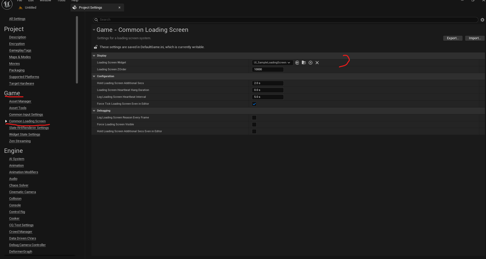

# Common Loading Screen Expanded

Features:
- Dynamic loading screen (from Lyra)
- Example loadings screen

Create your own loading screen:
- Any widget can become a loading screen, make sure you have your widget ready
- Set the desired loading screen in Project Settings | Game | Common Loading Screen

